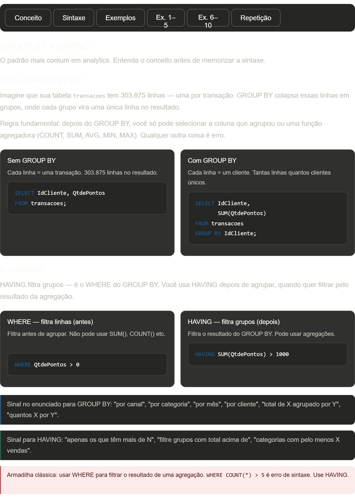

A aula está completa. Aqui está o fluxo de estudo recomendado:

**Hoje:** leia as abas "Conceito" e "Sintaxe" — entenda a ordem de execução (FROM → WHERE → GROUP BY → HAVING → SELECT → ORDER BY), porque ela explica 90% dos erros que iniciantes cometem.

**Depois:** abra o VS Code, conecte no `database.db` e execute os 4 exemplos da aba "Exemplos" antes de tentar os exercícios.

**Exercícios 1–5** são de aquecimento — fáceis e médios. O objetivo é sair dos 5 sentindo que os padrões básicos são automáticos.

**Exercícios 6–10** sobem o nível: combinam JOIN + WHERE + GROUP BY + HAVING ao mesmo tempo. O exercício 10 é o template completo — quando você conseguir escrever ele de cabeça, dominou o padrão.

**Aba Repetição:** 4 cards clicáveis que disparam novos exercícios com a mesma lógica mas em contextos diferentes — incluindo sua tabela `feature_store_cliente`, que você vai usar bastante na fase de Analytics Engineering.

Uma coisa para prestar atenção: os exercícios 2 e 8 usam técnicas que aparecem o tempo todo em relatórios reais — `SUM(CASE WHEN ...)` para agregação condicional e somar flags booleanas. Guarde esses dois.